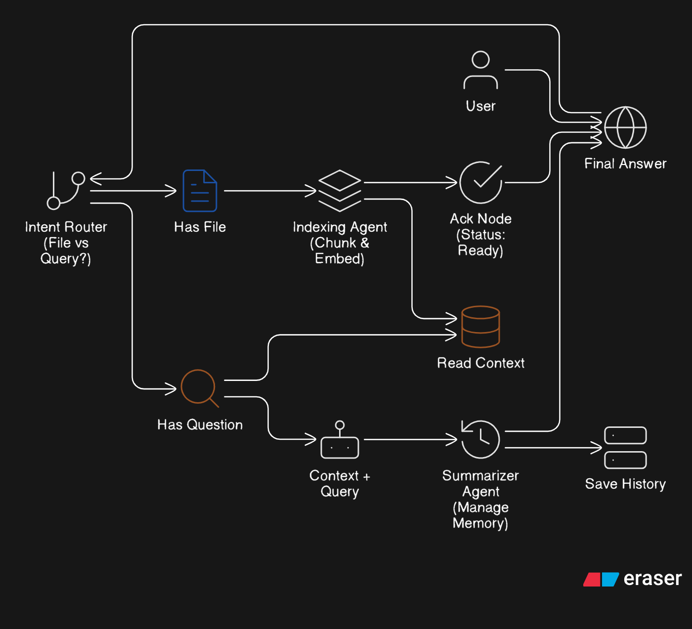

<div align="center">




# DocIQ — AI-Powered Document Intelligence Backend

**A production-grade, multi-agent backend for ingesting, processing, and querying complex documents.**

Built with **FastAPI** · **LangGraph** · **Google Gemini** · **FAISS** · **SQLite**

[](https://python.org)
[](https://fastapi.tiangolo.com)
[](https://langchain-ai.github.io/langgraph/)
[](LICENSE)

</div>

---

## What Is DocIQ?

DocIQ transforms static documents into interactive knowledge bases. Upload any PDF or image — whether it's a clean digital report or a messy scanned form — and immediately begin asking questions in natural language. The system automatically routes each document through a specialized multi-agent pipeline, extracts meaning with Vision LLMs where needed, and returns grounded, context-aware answers.

> **Why it matters:** Most RAG pipelines break on real-world documents — handwritten notes, complex tables, scanned invoices. DocIQ was designed from the ground up to handle them, combining fast text extraction with Vision LLM fallbacks and stateful conversation memory.

---

## Key Capabilities

| Capability | Details |
|---|---|
| 🤖 **Multi-Agent Orchestration** | State machine (LangGraph) coordinates Ingestion, Indexing, QA, and Summarization agents |
| 🔍 **Hybrid OCR Engine** | Fast PyMuPDF extraction with automatic Vision LLM (`gemini-2.5-flash-lite`) fallback for scanned/image PDFs |
| 🧠 **Context-Aware Memory** | Dedicated Summarization Agent condenses conversation history to prevent context window overflow |
| 📦 **Fully Local Storage** | FAISS vector store + SQLite for session state — no external cloud dependencies required |
| 📝 **Versioned Prompts** | AI behavior is decoupled from code via `prompts.yaml`, enabling prompt iteration without redeployment |
| ⚡ **REST API** | Clean, documented FastAPI endpoints with auto-generated Swagger UI |

---

## System Architecture

DocIQ is built on a **Graph-based State Machine** pattern, where each agent is a dedicated node responsible for a single concern. Documents enter the graph at ingestion and flow through the pipeline until a grounded answer is returned.


```
Document / Query
      │
      ▼
┌─────────────────┐
│  Ingestion Agent │  ← Detects text vs. scanned PDF; routes to Vision LLM if needed
└────────┬────────┘
         │
         ▼
┌─────────────────┐
│  Indexing Agent  │  ← Chunks text, generates embeddings, persists FAISS index per session
└────────┬────────┘
         │
         ▼
┌─────────────────┐
│  QA Specialist  │  ← Semantic retrieval (RAG) + answer formulation with conversation context
└────────┬────────┘
         │
         ▼
┌──────────────────────┐
│  Summarization Agent  │  ← Condenses history if threshold exceeded; prevents context overflow
└──────────────────────┘
         │
         ▼
    Answer ✅
```

### Agent Responsibilities

**Ingestion Agent**
Handles file parsing and routing. Detects whether a PDF is text-based or scanned. Text-based pages are processed locally via PyMuPDF for speed. Scanned or image-heavy pages are passed to a Vision LLM for high-fidelity transcription.

**Indexing Agent**
Receives clean text, applies Recursive Character Splitting for optimal chunk boundaries, generates vector embeddings via Google GenAI, and persists the result to a session-partitioned FAISS index on disk.

**QA Specialist**
At query time, performs semantic search over the session's FAISS index, retrieves the most relevant chunks, and synthesizes a grounded answer using both the retrieved context and the running conversation history.

**Summarization Agent**
Monitors conversation length after each QA turn. When history exceeds a configurable threshold, it generates a concise rolling summary — preserving continuity while keeping the LLM context window well within limits.

---

## Design Decisions & Trade-offs

### Accuracy over Speed — Vision OCR

**Decision:** Use multimodal Vision LLMs (`gemini-2.5-flash-lite`) instead of traditional OCR engines like Tesseract for image-based and scanned PDFs.

**Rationale:** Tesseract consistently degrades on real-world documents — handwriting, rotated text, dense tables, and mixed layouts all produce noisy output that undermines downstream retrieval quality. Vision LLMs handle these cases correctly out of the box.

**Trade-off:** Higher per-page processing latency (~2–5s vs. <0.1s for text extraction). Acceptable for document ingestion; not a bottleneck in the query path.

---

### Local-First Storage — FAISS + SQLite

**Decision:** All vector storage and session state is managed locally using FAISS and SQLite.

**Rationale:** Eliminates external dependencies (Pinecone, Weaviate, Postgres) for the initial deployment, reduces network latency for retrieval, and makes the project trivially reproducible on any machine with a valid API key.

**Trade-off:** Local FAISS is not horizontally scalable. A production deployment at scale would require migrating to a cloud-hosted vector database. This is a deliberate scope decision for the current phase.

---

### Explicit Summarization Node

**Decision:** Implement a dedicated LangGraph node for conversation summarization rather than truncating or sliding the history window.

**Rationale:** Naive truncation silently drops context, causing the model to contradict itself or re-ask for information already provided. A summarization node preserves semantic continuity across long sessions.

**Trade-off:** Adds one additional LLM call per turn when the threshold is exceeded, marginally increasing end-to-end latency. This is far preferable to unpredictable context overflow failures in production.

---

## Project Structure

```
.
├── app/
│   ├── agents/               # Ingestion, Indexing, QA, and Summarization agent logic
│   ├── core/
│   │   ├── config.py         # Configuration loader
│   │   └── prompts.yaml      # Versioned system prompts (AI behavior lives here)
│   ├── schema/               # Pydantic request/response models
│   └── main.py               # FastAPI application entry point
├── data/                     # Local vector stores (FAISS) and uploaded files
├── image.png                 # System architecture diagram
├── images.png                # UI screenshot
├── .env.example              # Environment variable template
├── requirements.txt          # Python dependencies
└── README.md                 # You are here
```

---

## Setup & Installation

### Prerequisites

- Python **3.10+**
- A valid **Google AI API Key** ([get one here](https://aistudio.google.com/app/apikey))

### 1. Clone the Repository

```bash
git clone https://github.com/ZAIN-UL-ABDIN-GHANI/Intelligent-Document-Workflow.git
cd "Intelligent Document Backend"
```

### 2. Create and Activate a Virtual Environment

```bash
python -m venv venv

# Windows
venv\Scripts\activate

# macOS / Linux
source venv/bin/activate
```

### 3. Install Dependencies

```bash
pip install -r requirements.txt
```

### 4. Configure Environment Variables

```bash
cp .env.example .env
```

Open `.env` and populate your keys:

```ini
# Required
GOOGLE_API_KEY=your_google_api_key_here

# Optional — only needed if switching to an OpenRouter-hosted model
OPENROUTER_API_KEY=
OPENROUTER_BASE_URL=
```

### 5. Start the Server

```bash
uvicorn main:app --reload
```

The API will be live at: **`http://127.0.0.1:8000`**

Interactive API docs: **`http://127.0.0.1:8000/docs`**

---

## API Reference

### POST `/upload` — Ingest a Document

Upload a PDF or image file to create a session.

**Request:** `multipart/form-data` with a `file` field.

**Response:**
```json
{
  "session_id": "a75a723c-f602-494a-b224-b016dd1986d1",
  "status": "success",
  "message": "Ready to query."
}
```

> Save the `session_id` — it is required for all subsequent chat requests.

---

### POST `/ask` — Query a Document

Send a natural language question against an ingested document session.

**Request:**
```json
{
  "session_id": "a75a723c-f602-494a-b224-b016dd1986d1",
  "question": "What is this document about?"
}
```

**Response:**
```json
{
  "answer": "This document describes an Escalation Orchestration System — a high-scale, cost-efficient platform that modernizes support operations using an Event-Driven Architecture. Key design principles include reliable queuing with circuit breakers, compliant audit-first writes, and cost optimization through caching and lightweight LLMs. The system automates low-risk resolutions and intelligently routes complex cases to human agents."
}
```

---

## Roadmap

These improvements are scoped for future iterations, ordered by expected impact:

- **Background Processing** — Move document ingestion to an async worker queue (Celery + RabbitMQ) to handle large files without HTTP timeout risk.
- **Hybrid Retrieval + Reranking** — Combine dense vector search with BM25 sparse retrieval and add a reranker (FlashRank) to improve retrieval precision on ambiguous queries.
- **Answer Citations** — Surface exact page numbers, chunk positions, and bounding box coordinates alongside each answer for full traceability.
- **Horizontal Scaling** — Migrate from local FAISS + SQLite to a cloud vector database (Pinecone / Qdrant) and a distributed session store for multi-instance deployments.
- **Streaming Responses** — Stream QA answers token-by-token via Server-Sent Events for a more responsive chat experience on long answers.

---

## Technology Stack

| Layer | Technology |
|---|---|
| API Framework | FastAPI |
| Agent Orchestration | LangGraph |
| LLM Provider | Google Gemini (`gemini-2.5-flash-lite`) |
| Vector Store | FAISS (local) |
| Session Storage | SQLite |
| PDF Parsing | PyMuPDF |
| Embeddings | Google GenAI Embeddings |
| Text Splitting | LangChain Recursive Character Splitter |

---

<div align="center">

Built by **Zainul Abdin Ghani** · [GitHub](https://github.com/ZAIN-UL-ABDIN-GHANI/Intelligent-Document-Workflow/)

</div>
